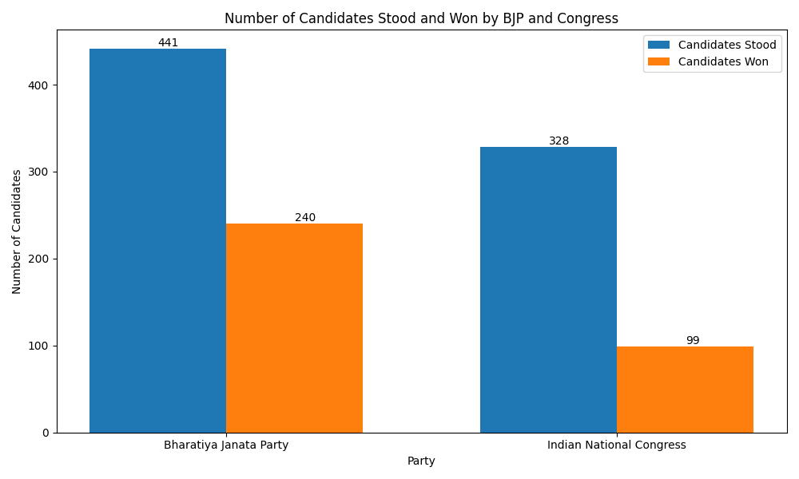

# Election Results Analysis

This repository contains a Python script to analyze the election results data and visualize the number of candidates stood and won by different parties, specifically focusing on BJP and Congress.

## Data

The data used in this analysis includes:

- `partywise_data.csv`: Contains information about the parties and the number of seats won.
- `constituencywise_data.csv`: Contains detailed information about the candidates, their parties, and the votes they received.

## Insights

1. **Total Seats**: The total number of seats in the election is 543.
2. **Majority Insight**: None of the parties have achieved a majority of more than 272 seats. The maximum number of seats won by a single party in this election is 240.
3. **Highest PCs**: The state with the highest number of Parliamentary Constituencies (PCs) is Uttar Pradesh, with 80 PCs.
4. **Victory in Uttar Pradesh**: In the zone with the highest number of PCs, BJP emerged victorious, having the highest overall votes.
5. **South Region Success**: In the south region, the Indian National Congress (INC) won, securing the second-highest overall votes, despite the zone having fewer PCs compared to the east and west.
6. **South Zone Participation**: Although the south zone had the highest number of individual candidates participating in the election, none of them won.
7. **Highest Vote Count**: From the Gujarat constituency, Amit Shah received the highest number of votes in the entire election.
8. **Madhya Pradesh Clean Sweep**: In the state of Madhya Pradesh, which has 29 PCs, all seats were won by a single party, BJP.
9. **Union Territories**: Across the Union Territories of India, BJP won the majority of seats.
10. **Party Participation**: Apart from individual candidates and NOTA, the Bahujan Samaj Party had 488 candidates participating in the election, but none won. Overall, BJP had the maximum number of candidates standing in the election and the highest number of wins.

## Analysis

The analysis counts the total number of candidates that stood for each party and the number of candidates that won. The results are specifically visualized for BJP and Congress.

## Graphs

The following graph shows the number of candidates that stood and won for BJP and Congress:

## How to Run

1. Clone the repository.
2. Install the required packages using `pip install -r requirements.txt`.
3. Run the script `election_results.py` to generate the analysis and the graphs.
4. Open `README.md` to view the analysis and the graphs.

## Requirements

- pandas
- matplotlib
- selenium
- webdriver-manager
